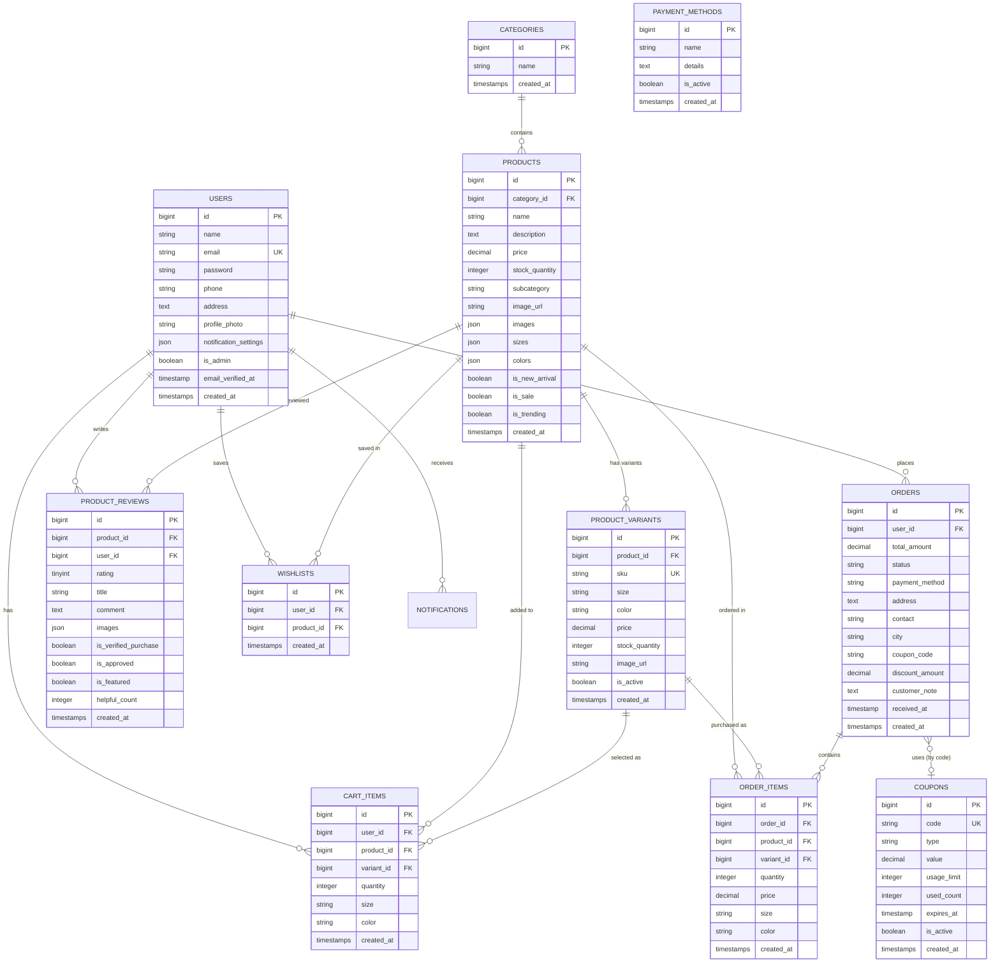
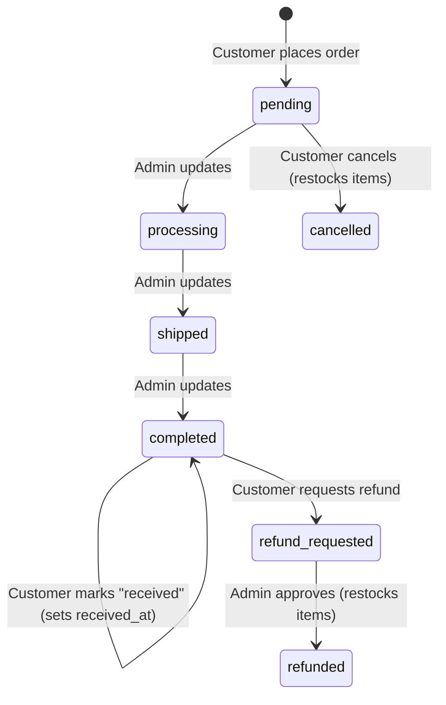
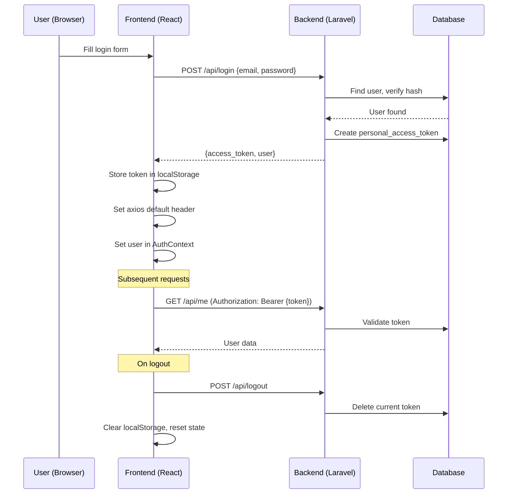

# 🛍️ PrimeWear — Project Documentation

> **Full-Stack Fashion E-Commerce Platform**
> Last updated: April 18, 2026

---

## Table of Contents

1. [Project Overview](#1-project-overview)
2. [Technology Stack](#2-technology-stack)
3. [Project Structure](#3-project-structure)
4. [Database Schema](#4-database-schema)
5. [Backend Architecture](#5-backend-architecture)
6. [API Reference](#6-api-reference)
7. [Frontend Architecture](#7-frontend-architecture)
8. [Authentication Flow](#8-authentication-flow)
9. [Admin Panel](#9-admin-panel)
10. [Deployment & DevOps](#10-deployment--devops)
11. [Environment Setup](#11-environment-setup)

---

## 1. Project Overview

**PrimeWear** is a full-stack, production-ready fashion e-commerce platform that enables customers to browse, search, and purchase clothing products with variant support (size/color), apply discount coupons, manage wishlists, leave product reviews, and track their orders — all through a modern, responsive React frontend powered by a robust Laravel REST API.

### Key Features

| Module | Capabilities |
|---|---|
| **Catalog** | Products with categories, subcategories, sizes, colors, images, variants (SKU-level), new-arrival/sale/trending flags |
| **Cart** | Variant-aware cart, stock validation, quantity management, slide-out drawer |
| **Orders** | Multi-status lifecycle (pending → processing → shipped → completed → received), cancellation, refund requests |
| **Coupons** | Percent or fixed-value discounts with usage limits and expiry dates |
| **Wishlist** | Toggle-based wishlist with persistent server state |
| **Reviews** | 1–5 star ratings, titles, comments, image attachments, verified-purchase badges, helpful votes, admin moderation |
| **Notifications** | Real-time database notifications for admins (new orders, cart adds) and customers (order status changes) |
| **Admin Dashboard** | Stats overview, order management, product CRUD, variant management, customer directory, coupon management, review moderation, reports & CSV export |
| **User Profile** | Profile photo upload, personal info editing, password changes, notification preferences |

---

## 2. Technology Stack

### Backend

| Component | Technology | Version |
|---|---|---|
| **Language** | PHP | ^8.1 |
| **Framework** | Laravel | ^8.75 |
| **Authentication** | Laravel Sanctum | ^2.11 |
| **CORS** | fruitcake/laravel-cors | ^2.0 |
| **HTTP Client** | GuzzleHTTP | ^7.0.1 |
| **REPL** | Laravel Tinker | ^2.5 |
| **Database** | MySQL | (via `pdo_mysql`) |
| **File Storage** | Local / Public disk | — |
| **Testing** | PHPUnit | ^9.5.10 |

### Frontend

| Component | Technology | Version |
|---|---|---|
| **Library** | React | ^19.2.0 |
| **Build Tool** | Vite | ^7.3.1 |
| **Routing** | React Router DOM | ^7.13.1 |
| **HTTP Client** | Axios | ^1.13.6 |
| **Animations** | Framer Motion | ^12.35.2 |
| **Icons** | Lucide React | ^0.577.0 |
| **Linting** | ESLint | ^9.39.1 |

### Infrastructure

| Concern | Solution |
|---|---|
| **Containerization** | Docker (PHP 8.1 CLI image) |
| **Backend Hosting** | Railway (via Dockerfile) |
| **Frontend Hosting** | Vercel (with SPA rewrites) |

---

## 3. Project Structure

```
Primewear/
├── backend/                         # Laravel 8 API
│   ├── app/
│   │   ├── Http/
│   │   │   ├── Controllers/         # 14 controllers
│   │   │   │   ├── AdminDashboardController.php
│   │   │   │   ├── AdminPaymentMethodController.php
│   │   │   │   ├── AdminReportController.php
│   │   │   │   ├── AdminReviewController.php
│   │   │   │   ├── AuthController.php
│   │   │   │   ├── CartController.php
│   │   │   │   ├── CategoryController.php
│   │   │   │   ├── CouponController.php
│   │   │   │   ├── OrderController.php
│   │   │   │   ├── ProductController.php
│   │   │   │   ├── ReviewController.php
│   │   │   │   └── WishlistController.php
│   │   │   ├── Middleware/
│   │   │   │   ├── IsAdmin.php      # Admin-only guard
│   │   │   │   └── ... (8 standard Laravel middleware)
│   │   │   └── Kernel.php
│   │   ├── Models/                  # 11 Eloquent models
│   │   │   ├── CartItem.php
│   │   │   ├── Category.php
│   │   │   ├── Coupon.php
│   │   │   ├── Order.php
│   │   │   ├── OrderItem.php
│   │   │   ├── PaymentMethod.php
│   │   │   ├── Product.php
│   │   │   ├── ProductReview.php
│   │   │   ├── ProductVariant.php
│   │   │   ├── User.php
│   │   │   └── Wishlist.php
│   │   └── Notifications/
│   │       ├── AdminEventNotification.php
│   │       └── OrderStatusUpdated.php
│   ├── config/                      # 15 config files (cors, sanctum, etc.)
│   ├── database/migrations/         # 30 migrations
│   ├── routes/
│   │   └── api.php                  # All API route definitions
│   ├── Dockerfile                   # Production Docker image
│   ├── composer.json
│   └── .env.example
│
├── frontend/                        # React 19 + Vite SPA
│   ├── src/
│   │   ├── components/              # 5 shared components
│   │   │   ├── CartDrawer.jsx
│   │   │   ├── Footer.jsx
│   │   │   ├── Navbar.jsx
│   │   │   ├── NotificationsDropdown.jsx
│   │   │   └── ReviewSection.jsx
│   │   ├── context/                 # 3 React Contexts
│   │   │   ├── AuthContext.jsx
│   │   │   ├── CartContext.jsx
│   │   │   └── WishlistContext.jsx
│   │   ├── pages/                   # 18 page components
│   │   │   ├── About.jsx
│   │   │   ├── AdminDashboard.jsx
│   │   │   ├── AdminGeneralSettings.jsx
│   │   │   ├── AdminPaymentMethod.jsx
│   │   │   ├── AdminReviews.jsx
│   │   │   ├── Cart.jsx
│   │   │   ├── Home.jsx
│   │   │   ├── Login.jsx
│   │   │   ├── OrderHistory.jsx
│   │   │   ├── ProductDetail.jsx
│   │   │   ├── Register.jsx
│   │   │   ├── Reports.jsx
│   │   │   ├── SettingsGeneral.jsx
│   │   │   ├── SettingsNotifications.jsx
│   │   │   ├── SettingsSecurity.jsx
│   │   │   ├── Shop.jsx
│   │   │   ├── UserProfile.jsx
│   │   │   └── WishlistPage.jsx
│   │   ├── App.jsx                  # Root component with routing
│   │   ├── main.jsx                 # Entry point
│   │   └── index.css                # Global styles
│   ├── vercel.json                  # Vercel SPA rewrite config
│   ├── vite.config.js
│   └── package.json
```

---

## 4. Database Schema

### Entity-Relationship Diagram



### Order Status Lifecycle



### Migration History (30 migrations)

| # | Migration | Description |
|---|---|---|
| 1 | `create_users_table` | Core users table with auth fields |
| 2 | `create_password_resets_table` | Password reset tokens |
| 3 | `create_failed_jobs_table` | Failed queue jobs |
| 4 | `create_personal_access_tokens_table` | Sanctum API tokens |
| 5 | `create_categories_table` | Product categories |
| 6 | `create_products_table` | Core products table |
| 7 | `create_orders_table` | Customer orders |
| 8 | `create_order_items_table` | Order line items |
| 9 | `create_cart_items_table` | Shopping cart items |
| 10 | `add_address_to_orders_table` | Shipping address on orders |
| 11 | `add_contact_and_city_to_orders_table` | Contact info & city on orders |
| 12 | `add_variations_to_products_table` | Sizes/colors JSON on products |
| 13 | `add_size_and_color_to_cart_and_order_items` | Size/color fields on line items |
| 14 | `add_is_new_arrival_to_products_table` | New arrival flag |
| 15 | `add_is_sale_to_products_table` | Sale flag |
| 16 | `replace_test_with_sale_category` | Data migration for SALE category |
| 17 | `add_profile_photo_to_users_table` | User profile photo path |
| 18 | `add_notification_settings_to_users_table` | User notification preferences |
| 19 | `create_notifications_table` | Laravel notifications table |
| 20 | `create_payment_methods_table` | Payment method settings |
| 21 | `create_product_variants_table` | SKU-level variants + FK on cart/order items |
| 22 | `create_product_reviews_table` | Product reviews with ratings, images, moderation |
| 23 | `add_received_at_to_orders_table` | Delivery confirmation timestamp |
| 24 | `add_images_to_products_table` | Multi-image JSON column on products |
| 25 | `add_is_trending_to_products_table` | Trending flag |
| 26 | `create_wishlists_table` | User wishlists |
| 27 | `create_coupons_table` | Discount coupons |
| 28 | `add_coupon_to_orders_table` | Coupon code/discount on orders |
| 29 | `add_subcategory_to_products_table` | Subcategory field |
| 30 | `add_phone_and_address_to_users_table` | Phone & address on users |
| 31 | `add_customer_note_to_orders_table` | Customer note on orders |

---

## 5. Backend Architecture

### Middleware Stack

| Middleware | Alias | Purpose |
|---|---|---|
| `Authenticate` | `auth` | Ensures user is authenticated |
| `IsAdmin` | `is_admin` | Ensures authenticated user has `is_admin = true` |
| `HandleCors` | — (global) | CORS headers via `fruitcake/laravel-cors` |
| `TrustProxies` | — (global) | Trusts reverse proxy headers (Railway, etc.) |

### Authentication Strategy

- **Token-based** using **Laravel Sanctum** (Personal Access Tokens)
- Tokens are stored in the database (`personal_access_tokens` table)
- Frontend stores the token in `localStorage` and attaches it as a `Bearer` token on every request
- No cookie/session-based auth — purely stateless API

### Models & Relationships

| Model | Key Relationships | Notable Accessors/Scopes |
|---|---|---|
| **User** | `hasMany` CartItem, Order | `is_admin` cast, `notification_settings` JSON cast |
| **Category** | `hasMany` Product | — |
| **Product** | `belongsTo` Category, `hasMany` ProductVariant, ProductReview | `total_stock`, `available_sizes`, `available_colors`, `average_rating`, `reviews_count`, `rating_distribution` |
| **ProductVariant** | `belongsTo` Product | `effective_price`, `display_name`, `isInStock()`, scopes: `active`, `inStock` |
| **ProductReview** | `belongsTo` Product, User | `first_image`, `formatted_date`, `user_display_name`, scopes: `approved`, `featured`, `verifiedPurchase` |
| **CartItem** | `belongsTo` User, Product, ProductVariant | `display_size`, `display_color` |
| **Order** | `belongsTo` User, `hasMany` OrderItem | `canBeReceived()`, `isReceived()`, `canBeReviewed()`, `getUnreviewedProducts()` |
| **OrderItem** | `belongsTo` Order, Product, ProductVariant | — |
| **Coupon** | — | `code`, `type` (percent/fixed), `value`, `usage_limit`, `used_count`, `expires_at` |
| **Wishlist** | `belongsTo` User, Product | — |
| **PaymentMethod** | — | `name`, `details`, `is_active` |

### Notifications

| Notification Class | Channel | Triggered By |
|---|---|---|
| `AdminEventNotification` | Database | Customer adds to cart, places order |
| `OrderStatusUpdated` | Database | Admin changes order status |

---

## 6. API Reference

> **Base URL:** `{BACKEND_URL}/api`
> **Auth:** Routes under "Protected" require `Authorization: Bearer {token}` header.

### 🔓 Public Routes

| Method | Endpoint | Controller | Description |
|---|---|---|---|
| `POST` | `/register` | `AuthController@register` | Register a new user |
| `POST` | `/login` | `AuthController@login` | Login & receive token |
| `GET` | `/categories` | `CategoryController@index` | List all categories |
| `GET` | `/categories/{id}` | `CategoryController@show` | Get single category |
| `GET` | `/products` | `ProductController@index` | List all products |
| `GET` | `/products/{id}` | `ProductController@show` | Get single product |

### 🔐 Protected Routes (requires `auth:sanctum`)

#### User & Auth

| Method | Endpoint | Description |
|---|---|---|
| `GET` | `/me` | Get current user profile |
| `POST` | `/me` | Update profile (supports `multipart/form-data` for photo upload) |
| `POST` | `/me/password` | Change password (requires `current_password`, `password`, `password_confirmation`) |
| `POST` | `/logout` | Revoke current token |
| `GET` | `/notifications` | List user notifications |
| `POST` | `/notifications/{id}/read` | Mark notification as read |

#### Cart

| Method | Endpoint | Description |
|---|---|---|
| `GET` | `/cart` | List cart items (with product & variant) |
| `POST` | `/cart` | Add item to cart (`product_id`, `quantity`, `size`, `color`, `variant_id`) |
| `PUT` | `/cart/{id}` | Update cart item quantity |
| `DELETE` | `/cart/{id}` | Remove item from cart |
| `DELETE` | `/cart` | Clear entire cart |

#### Wishlist

| Method | Endpoint | Description |
|---|---|---|
| `GET` | `/wishlist` | List wishlist items |
| `POST` | `/wishlist/toggle` | Toggle product in wishlist (`product_id`) |

#### Coupons

| Method | Endpoint | Description |
|---|---|---|
| `GET` | `/coupons/active` | List active coupons |
| `POST` | `/coupons/validate` | Validate a coupon code |

#### Orders

| Method | Endpoint | Description |
|---|---|---|
| `GET` | `/orders` | List user's orders |
| `POST` | `/orders` | Place a new order (`payment_method`, `address`, `contact`, `city`, `selected_item_ids[]`, `coupon_code`, `customer_note`) |
| `GET` | `/orders/{id}` | Get order details |
| `POST` | `/orders/{id}/cancel` | Cancel a pending order (restocks items) |
| `POST` | `/orders/{id}/refund` | Request refund on completed/delivered order |
| `POST` | `/orders/{id}/received` | Mark order as received by customer |
| `GET` | `/orders/{id}/reviewable-products` | Get products eligible for review from this order |

#### Reviews

| Method | Endpoint | Description |
|---|---|---|
| `GET` | `/products/{id}/reviews` | List approved reviews (filter by `rating`, `verified_only`, `with_images`; sort by `newest`/`highest`/`lowest`/`helpful`) |
| `POST` | `/products/{id}/reviews` | Submit a review (`rating`, `title`, `comment`, `images[]`) |
| `PUT` | `/products/{id}/reviews/{reviewId}` | Update own review |
| `DELETE` | `/products/{id}/reviews/{reviewId}` | Delete review (owner or admin) |
| `POST` | `/products/{id}/reviews/{reviewId}/helpful` | Vote review as helpful |
| `GET` | `/products/{id}/can-review` | Check if user can review this product |

### 🔒 Admin Routes (requires `auth:sanctum` + `is_admin`)

> **Prefix:** `/admin`

#### Dashboard & Stats

| Method | Endpoint | Description |
|---|---|---|
| `GET` | `/admin/stats` | Dashboard statistics (revenue, orders, products, users) |

#### Order Management

| Method | Endpoint | Description |
|---|---|---|
| `GET` | `/admin/orders` | List all orders with user & items |
| `PUT` | `/admin/orders/{id}/status` | Update order status (notifies customer) |

#### Product Management

| Method | Endpoint | Description |
|---|---|---|
| `GET` | `/admin/products` | List all products with categories & variants |
| `POST` | `/admin/products` | Create product (supports `multipart/form-data` for images) |
| `PUT` | `/admin/products/{id}` | Update product |
| `DELETE` | `/admin/products/{id}` | Delete product |

#### Variant Management

| Method | Endpoint | Description |
|---|---|---|
| `GET` | `/admin/products/{id}/variants` | List variants for a product |
| `POST` | `/admin/products/{id}/variants` | Create single variant |
| `POST` | `/admin/products/{id}/variants/bulk` | Bulk-create variants from size×color matrix |
| `PUT` | `/admin/products/{id}/variants/{variantId}` | Update variant |
| `DELETE` | `/admin/products/{id}/variants/{variantId}` | Delete variant |

#### Category Management

| Method | Endpoint | Description |
|---|---|---|
| `POST` | `/admin/categories` | Create category |
| `PUT` | `/admin/categories/{id}` | Update category |
| `DELETE` | `/admin/categories/{id}` | Delete category |

#### Coupon Management

| Method | Endpoint | Description |
|---|---|---|
| `GET` | `/admin/coupons` | List all coupons |
| `POST` | `/admin/coupons` | Create coupon (`code`, `type`, `value`, `usage_limit`, `expires_at`) |
| `DELETE` | `/admin/coupons/{id}` | Delete coupon |

#### Reports & Analytics

| Method | Endpoint | Description |
|---|---|---|
| `GET` | `/admin/reports/sales` | Sales report with date range (`start_date`, `end_date`) |
| `GET` | `/admin/reports/monthly` | Monthly revenue/order chart data (`months` param) |
| `GET` | `/admin/reports/products` | Top selling products & low stock report |
| `GET` | `/admin/reports/export` | CSV export (`type`: orders/products, `start_date`, `end_date`) |

#### Payment Settings

| Method | Endpoint | Description |
|---|---|---|
| `GET` | `/admin/payment-method` | Get payment method settings |
| `PUT` | `/admin/payment-method` | Update payment method settings |

#### Review Moderation

| Method | Endpoint | Description |
|---|---|---|
| `GET` | `/admin/reviews` | List all reviews (including pending) |
| `POST` | `/admin/reviews/{id}/approve` | Approve a review |
| `POST` | `/admin/reviews/{id}/reject` | Reject a review |
| `POST` | `/admin/reviews/{id}/feature` | Toggle featured status |
| `DELETE` | `/admin/reviews/{id}` | Delete a review |
| `POST` | `/admin/reviews/bulk-approve` | Bulk approve reviews |
| `POST` | `/admin/reviews/bulk-delete` | Bulk delete reviews |

---

## 7. Frontend Architecture

### Routing Map

```mermaid
graph TD
    A["/ (Home)"] --> B["/shop"]
    A --> C["/about"]
    A --> D["/product/:id"]
    A --> E["/login"]
    A --> F["/register"]
    A --> G["/cart"]
    A --> H["/orders"]
    A --> I["/wishlist"]
    A --> J["/profile"]
    A --> K["/settings/general"]
    A --> L["/settings/security"]
    A --> M["/settings/notifications"]
    
    N["Admin Routes"] --> O["/admin (Dashboard)"]
    N --> P["/admin/reports"]
    N --> Q["/admin/reviews"]
    N --> R["/admin/settings"]
    N --> S["/admin/payment-method"]
```



### Page Components (18)

| Page | Route | Size | Description |
|---|---|---|---|
| [Home.jsx](file:///c:/Users/Public/Primewear/frontend/src/pages/Home.jsx) | `/` | 29 KB | Landing page with hero, featured products, new arrivals, trending |
| [Shop.jsx](file:///c:/Users/Public/Primewear/frontend/src/pages/Shop.jsx) | `/shop` | 29 KB | Product catalog with filters, search, category/sort options |
| [ProductDetail.jsx](file:///c:/Users/Public/Primewear/frontend/src/pages/ProductDetail.jsx) | `/product/:id` | 31 KB | Full product page with gallery, variant selection, reviews |
| [Cart.jsx](file:///c:/Users/Public/Primewear/frontend/src/pages/Cart.jsx) | `/cart` | 23 KB | Full cart page with checkout flow, order notes, coupon application |
| [OrderHistory.jsx](file:///c:/Users/Public/Primewear/frontend/src/pages/OrderHistory.jsx) | `/orders` | 32 KB | Order list with status tracking, customer notes, cancel/refund/received actions |
| [WishlistPage.jsx](file:///c:/Users/Public/Primewear/frontend/src/pages/WishlistPage.jsx) | `/wishlist` | 4 KB | Saved products grid |
| [Login.jsx](file:///c:/Users/Public/Primewear/frontend/src/pages/Login.jsx) | `/login` | 4 KB | Login form |
| [Register.jsx](file:///c:/Users/Public/Primewear/frontend/src/pages/Register.jsx) | `/register` | 6 KB | Registration form with phone/address fields |
| [UserProfile.jsx](file:///c:/Users/Public/Primewear/frontend/src/pages/UserProfile.jsx) | `/profile` | 10 KB | User profile with photo upload |
| [SettingsGeneral.jsx](file:///c:/Users/Public/Primewear/frontend/src/pages/SettingsGeneral.jsx) | `/settings/general` | 3 KB | Account settings |
| [SettingsSecurity.jsx](file:///c:/Users/Public/Primewear/frontend/src/pages/SettingsSecurity.jsx) | `/settings/security` | 4 KB | Password change |
| [SettingsNotifications.jsx](file:///c:/Users/Public/Primewear/frontend/src/pages/SettingsNotifications.jsx) | `/settings/notifications` | 3 KB | Notification preferences |
| [About.jsx](file:///c:/Users/Public/Primewear/frontend/src/pages/About.jsx) | `/about` | 12 KB | About page |
| [AdminDashboard.jsx](file:///c:/Users/Public/Primewear/frontend/src/pages/AdminDashboard.jsx) | `/admin` | **122 KB** | Full admin panel (stats, orders, products, customers, coupons, variants) |
| [Reports.jsx](file:///c:/Users/Public/Primewear/frontend/src/pages/Reports.jsx) | `/admin/reports` | 35 KB | Sales analytics, charts, CSV export |
| [AdminReviews.jsx](file:///c:/Users/Public/Primewear/frontend/src/pages/AdminReviews.jsx) | `/admin/reviews` | 21 KB | Review moderation panel |
| [AdminGeneralSettings.jsx](file:///c:/Users/Public/Primewear/frontend/src/pages/AdminGeneralSettings.jsx) | `/admin/settings` | 4 KB | Admin general settings |
| [AdminPaymentMethod.jsx](file:///c:/Users/Public/Primewear/frontend/src/pages/AdminPaymentMethod.jsx) | `/admin/payment-method` | 3 KB | Payment method configuration |

### Shared Components (5)

| Component | Size | Description |
|---|---|---|
| [Navbar.jsx](file:///c:/Users/Public/Primewear/frontend/src/components/Navbar.jsx) | 16 KB | Global navigation bar with search, cart icon, user menu |
| [CartDrawer.jsx](file:///c:/Users/Public/Primewear/frontend/src/components/CartDrawer.jsx) | 11 KB | Slide-out cart drawer overlay |
| [Footer.jsx](file:///c:/Users/Public/Primewear/frontend/src/components/Footer.jsx) | 9 KB | Site footer |
| [NotificationsDropdown.jsx](file:///c:/Users/Public/Primewear/frontend/src/components/NotificationsDropdown.jsx) | 5 KB | Bell icon dropdown with notification list |
| [ReviewSection.jsx](file:///c:/Users/Public/Primewear/frontend/src/components/ReviewSection.jsx) | 19 KB | Reusable product review display & submission form |

### Context Providers (3)

| Context | Key State | Exposed Methods |
|---|---|---|
| [AuthContext](file:///c:/Users/Public/Primewear/frontend/src/context/AuthContext.jsx) | `user`, `loading` | `login()`, `register()`, `logout()`, `updateUser()` |
| [CartContext](file:///c:/Users/Public/Primewear/frontend/src/context/CartContext.jsx) | `cart[]`, `isCartOpen` | `addToCart()`, `removeFromCart()`, `updateCartItemQuantity()`, `checkout()`, `fetchCart()` |
| [WishlistContext](file:///c:/Users/Public/Primewear/frontend/src/context/WishlistContext.jsx) | `wishlist[]` | `toggleWishlist()`, `isInWishlist()`, `fetchWishlist()` |

### Provider Hierarchy

```
<Router>
  <AuthProvider>          ← Token management, user state
    <CartProvider>        ← Cart CRUD, checkout
      <WishlistProvider>  ← Wishlist toggle
        <AppLayout />     ← Routing, Navbar/Footer conditional rendering
      </WishlistProvider>
    </CartProvider>
  </AuthProvider>
</Router>
```

### Layout Behavior

- **Customer routes** (`/`, `/shop`, `/cart`, etc.): Render `Navbar`, `CartDrawer`, page content, and `Footer`
- **Admin routes** (`/admin/*`): Render page content **only** (no Navbar/Footer — the admin dashboard has its own navigation)

---

## 8. Authentication Flow



### Registration Fields
- `name` (required)
- `email` (required, unique)
- `password` (required, min 8 chars)
- `phone` (required)
- `address` (required)

### Token Persistence
On page reload, `AuthContext` checks for a token in `localStorage`. If found, it calls `GET /api/me` to restore the user session. If the token is invalid/expired, it clears localStorage.

---

## 9. Admin Panel

The admin panel is a comprehensive management dashboard accessible at `/admin` for users with `is_admin = true`.

### Feature Matrix

| Tab | Capabilities |
|---|---|
| **Dashboard** | Revenue, order count, product count, user count overview cards |
| **Orders** | View all orders, filter by status, update status (triggers customer notification), view order details, customer notes & items |
| **Products** | Full CRUD with image upload, category assignment, size/color configuration, sale/trending/new-arrival flags |
| **Variants** | Per-product SKU management, bulk create from size×color matrix, individual stock & price control |
| **Customers** | Customer directory with order count and total spend |
| **Coupons** | Create percent/fixed coupons with usage limits & expiry, delete coupons |
| **Reports** | Sales reports (date range), monthly revenue charts, top-selling products, low-stock alerts, CSV export |
| **Reviews** | Approve/reject reviews, toggle featured, bulk actions, delete |
| **Settings** | General settings, payment method configuration |

### Admin Guard

```php
// app/Http/Middleware/IsAdmin.php
if ($request->user() && $request->user()->is_admin) {
    return $next($request);
}
return response()->json(['message' => 'Unauthorized. Admin access required.'], 403);
```

Registered as `is_admin` alias in `Kernel.php` and applied to all `/admin/*` API routes.

---

## 10. Deployment & DevOps

### Backend Deployment (Railway via Docker)

The backend is containerized using a [Dockerfile](file:///c:/Users/Public/Primewear/backend/Dockerfile):

```dockerfile
FROM php:8.1-cli
# Installs: git, curl, libpng-dev, libonig-dev, libxml2-dev, zip, unzip, libzip-dev, mysql-client
# PHP Extensions: pdo_mysql, mbstring, exif, pcntl, bcmath, gd, zip
# Copies Composer from official image
# Runs: composer install --optimize-autoloader --no-dev
# Creates: storage:link for uploaded images
# Exposes: port 8000
# CMD: php artisan serve --host=0.0.0.0 --port=${PORT:-8000}
```

> [!NOTE]
> Railway injects a `PORT` environment variable. The `CMD` falls back to `8000` if not set.

### Frontend Deployment (Vercel)

Configured via [vercel.json](file:///c:/Users/Public/Primewear/frontend/vercel.json):

```json
{
  "rewrites": [
    { "source": "/(.*)", "destination": "/index.html" }
  ]
}
```

This ensures all routes are handled by the React SPA's client-side router.

### CORS Configuration

```php
// config/cors.php
'paths' => ['api/*', 'sanctum/csrf-cookie'],
'allowed_origins' => ['*'],
'allowed_methods' => ['*'],
'allowed_headers' => ['*'],
'supports_credentials' => true,
```

> [!WARNING]
> `allowed_origins` is currently set to `*` (wildcard). For production, consider restricting this to your Vercel domain(s).

---

## 11. Environment Setup

### Prerequisites

- **PHP** ≥ 8.1
- **Composer** ≥ 2.x
- **Node.js** ≥ 18.x + npm
- **MySQL** 5.7+ or 8.x
- **Git**

### Backend Setup

```bash
# 1. Navigate to backend
cd backend

# 2. Install PHP dependencies
composer install

# 3. Copy environment file
cp .env.example .env

# 4. Generate app key
php artisan key:generate

# 5. Configure .env with your database credentials
#    DB_HOST=127.0.0.1
#    DB_PORT=3306
#    DB_DATABASE=primewear
#    DB_USERNAME=root
#    DB_PASSWORD=your_password

# 6. Run migrations
php artisan migrate

# 7. Create storage symlink (for file uploads)
php artisan storage:link

# 8. Start development server
php artisan serve
# → http://127.0.0.1:8000
```

### Frontend Setup

```bash
# 1. Navigate to frontend
cd frontend

# 2. Install Node dependencies
npm install

# 3. Create .env (optional — defaults to localhost:8000)
echo "VITE_API_BASE_URL=http://127.0.0.1:8000/api" > .env

# 4. Start development server
npm run dev
# → http://localhost:5173
```

### Environment Variables

#### Backend (`.env`)

| Variable | Description | Default |
|---|---|---|
| `APP_KEY` | Laravel encryption key | (generated) |
| `APP_ENV` | Environment | `local` |
| `APP_DEBUG` | Debug mode | `true` |
| `APP_URL` | Backend URL | `http://localhost` |
| `DB_CONNECTION` | Database driver | `mysql` |
| `DB_HOST` | Database host | `127.0.0.1` |
| `DB_PORT` | Database port | `3306` |
| `DB_DATABASE` | Database name | `laravel` |
| `DB_USERNAME` | Database user | `root` |
| `DB_PASSWORD` | Database password | (empty) |

#### Frontend (`.env`)

| Variable | Description | Default |
|---|---|---|
| `VITE_API_BASE_URL` | Full API URL | `http://127.0.0.1:8000/api` |
| `VITE_BACKEND_URL` | Backend base URL (alternative) | — |

---

> [!TIP]
> **Creating an Admin User:** After running migrations, use Laravel Tinker to promote a user:
> ```bash
> php artisan tinker
> >>> User::where('email', 'admin@example.com')->update(['is_admin' => true]);
> ```

---

*This documentation was generated by analyzing the full PrimeWear codebase — 14 controllers, 11 models, 30 migrations, 18 pages, 5 components, and 3 context providers.*
